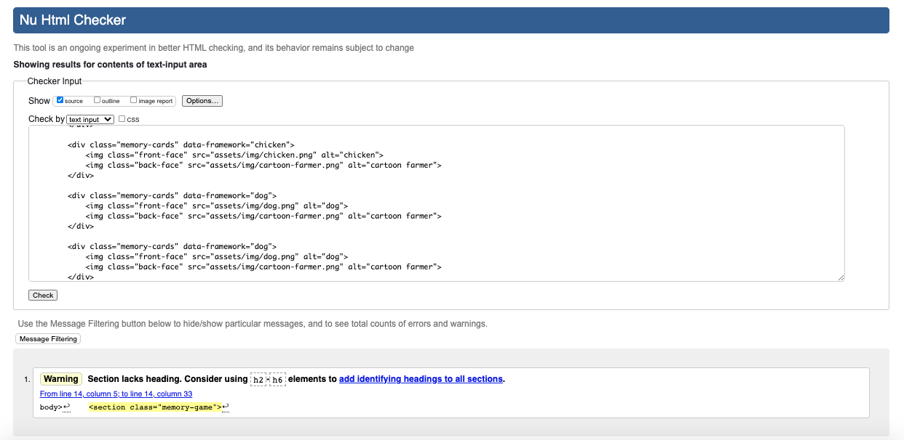
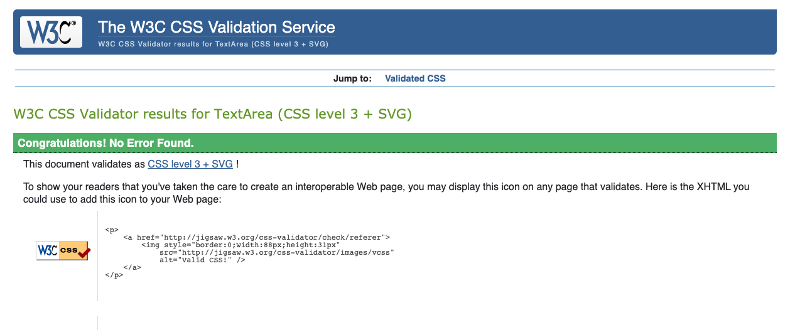

# farm-animals-memory-learning-game
## User Experiance
----
### User Stories
1. I would like the game to be intuitive to use therefore having no need for a set of instructions
2. I also would like it to be an enjoyable game that holds the attention of the user
3. Finally I would like the game to be visually appealing

### Owner goals
1. I would like the game to be exciting for the user by being interactive for example by letting the user know what score theyve got
2. I would like the game to  help teach kids farm animals by associating the words with the pictures through this game.
3. I would like the game to be well designed in terms of look/style, does it look modern? 

----

## Design

----

### Colour Scheme
 • Background will be a cartoon of a farm and a fall back of a white background, the farm will have green grass, blue sky and a red barn/house
 * the card colour will contrast against this background, the colour will be grey with a black border
 * the text colour will contrast against the grey and will be black

### Font Styles

The font will be simple and easy to read due to the user being a child looking to learn the animals names, so, the font will be in Open sans

### Image styles

* the Images will be cartoons due to the simplicity and universal understanding cartoons achieve.

### Wireframes

----
 
 ### Languages and technologies used
 * HTML
 * CSS
* Javascript
* GitHub
* Git
* Photoshop
* Balsamiq
* Google fonts

----
## Testing
There were no errors with html testing:

There were no errors with css testing: 

Javascript: i have had issues with javascript from the start, after only starting to learn Javascrpt coding 2 months ago i have continuously struggled with very little help from mentors and tutors that i have frequently reached out to, they have provided very little help with helping me understand how to code javascript and understand what each part does and how it all ineracts together. what i have put together is my best effort at making a cards flip over revealing the front cards, i am aware that the code does not work, however, im unsure how to fix this issue and have gone to tutors multiple times asking for help on how i should go about fixing this issue and have been provided with nothing to aid me.

----
## Deployment

The project was deployed to GitHub Pages using the following steps...

* Log in to GitHub and locate the GitHub Repository
* At the top of the Repository (not top of page), locate the "Settings" Button on the menu.
* Alternatively Click Here for a GIF demonstrating the process starting from Step 2.
* Scroll down the Settings page until you locate the "GitHub Pages" Section.
* Under "Source", click the dropdown called "None" and select "Master Branch".
* The page will automatically refresh.
* Scroll back down through the page to locate the now published site link in the "GitHub Pages" section.
----

## Credits
* from this website i got the image of all the farm animals used in the game, images used in the game have been cut out from this image: https://i.pinimg.com/originals/7a/e5/65/7ae565b3348527003ab1e0c0e17747fa.png
* The image on the back of the cards has come from here: https://www.clipartmax.com/png/middle/27-270409_cartoon-farmer-no-background.png
* The background game image came from: https://www.clipartmax.com/png/middle/27-270409_cartoon-farmer-no-background.png

----

## issues

As previously stated in the javascript part, i have constantly been strugling to understand javascript and have had very little success in understanding how the code works and how i can learn to impliment it, what i have produced is my best effort at making what i have been asked to make, if i was given more time in understanding and leanrning this code i have no doubt that i wouldve understood and learnt how to use javascript, however 2 months is not sufficent enough time to comprehend such complex topics and concepts, 3 weeks before before writing this project into gitpod, i wrote out the project in atom to try and make sense of it all and came up equally as short with solutions. i have tried night and day at least 7 hours per day to understand the basic concepts of javascript and at this point im still extremely unsure of how things work. i have reached out to tutors, friends, family and my mentor, all have been unsucessful in helping me. as stateed above, i find 2 months to go from 0 understanding of javascript and its concepts to coding a fully functioning game absolutely ridiculous and can only be designed to set me up to fail. i am sorry that my code does not work, but i have tried my best.